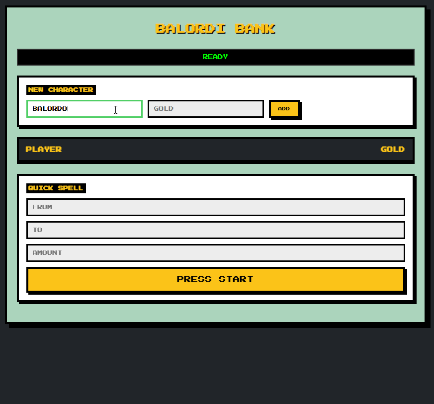

# BalordiFinance Backend

Distributed banking ecosystem designed to demonstrate the integration between an actor model (Elixir), ingestor (Go) and UI (React)

<p align="center">
  
</p>

## Architecture
This project consists of three independent components working together:
- **Core Backend (Elixir)**: It manages bank accounts as isolated processes (GenServers) within a supervision tree, ensuring fault tolerance and state consistency.
- **High-Speed Ingestor (Go)**: A CLI tool built to handle massive transaction volumes. It processes CSV data in parallel using a worker pool pattern to stress-test the backend API.
- **Real-Time Dashboard (React)**: A pixel-art themed interface that displays account balances in real-time. It uses custom Hooks to separate business logic from the UI.

## Key Features
- **Fault Tolerance**: Every bank account is a standalone process; if one crashes, the rest of the system remains unaffected.
- **Concurrency**: The ingestor allows thousands of transactions to be sent concurrently without blocking the main flow.
- **Retro Aesthetics**: A custom 8-bit pixel art theme for an Arcade experience.

## Installation
1. Clone the repository
2. Backend (Elixir):
  ```bash
  cd balordi_finance_server
  mix deps.get
  iex -S mix
  ```
3. Dashboard (React):
  Create a .env file in balordi_ui/ with REACT_APP_API_URL=http://localhost:4005.
  ```bash
  cd balordi_ui
  npm install
  npm start
  ```
4. Ingestor (Go)
  ```bash
  cd balordi_ingestor
  go run main.go
  ```

## License 
This project was built for educational and portfolio purposes. Feel free to explore the code.